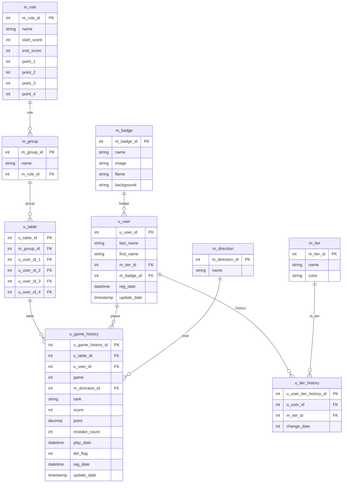

# 麻雀成績管理サイト

* ※身内間ですが、サービス稼働中

## 開発環境
* バックエンド：PHP
* フロントエンド：JavaScript, HTML, CSS
* データベース：MySQL
* インフラ/環境：XAMPP（ローカル環境）、Xserver（本番デプロイ）

---

## 機能一覧

## 全体成績

## 個人成績

### 称号変更

## 成績登録

## 成績履歴

### 成績個人履歴

## Admin

# DB 設計書

## 全体像

* **命名規則**: マスタは `m_*`、ユーザー・利用系は `u_*`
* **主な機能**: 卓（テーブル）編成、対局履歴、階級（Tier）、称号（Badge）、ルール設定。
* **リレーション（論理）**

  * ルール(`m_rule`) ← グループ(`m_group`) ← 卓(`u_table`) ← 対局履歴(`u_game_history`)
  * ユーザー(`u_user`) ← 対局履歴(`u_game_history`)
  * 自家(`m_direction`) ← 対局履歴(`u_game_history`)
  * ユーザー(`u_user`) ← 階級履歴(`u_tier_history`) → 階級(`m_tier`)
  * ユーザー(`u_user`) → 称号(`m_badge`)

---

## ER 図（Mermaid）

---

## テーブル定義（詳細）

### 1) m_rule — ルール

| 列           | 型                    | Null | 既定値       | 説明                 |
| ----------- | -------------------- | ---- | --------- | ------------------ |
| m_rule_id   | TINYINT(3) UNSIGNED  | NO   | -         | PK                 |
| name        | VARCHAR(64)          | NO   | 'UNKNOWN' | ルール名（例: Mリーグ/最高位戦） |
| start_score | SMALLINT(5) UNSIGNED | NO   | 0         | 配原点（配分の起点点数）       |
| end_score   | SMALLINT(5) UNSIGNED | NO   | 0         | 返し点（精算の基準点）        |
| point_1..4  | TINYINT(3)           | NO   | 0         | 順位ウマ（1〜4位）         |

**ポイント計算**: `((score - end_score) / 1000) + UMA(rank)`

### 2) m_group — グループ（卓の種別）

| 列          | 型                   | Null | 既定値       | 説明             |
| ---------- | ------------------- | ---- | --------- | -------------- |
| m_group_id | TINYINT(3) UNSIGNED | NO   | -         | PK             |
| name       | VARCHAR(64)         | NO   | 'UNKNOWN' | グループ名（A卓・B卓など） |
| m_rule_id  | TINYINT(3) UNSIGNED | NO   | 0         | 適用ルール FK       |

### 3) u_table — 卓（対局メンバー）

| 列              | 型                   | Null | 既定値 | 説明                    |
| -------------- | ------------------- | ---- | --- | --------------------- |
| u_table_id     | TINYINT(3) UNSIGNED | NO   | -   | PK                    |
| m_group_id     | TINYINT(3) UNSIGNED | NO   | 0   | グループ FK（→ m_group）    |
| u_user_id_1..4 | TINYINT(3) UNSIGNED | NO   | 0   | その卓の参加者 1〜4（→ u_user） |

### 4) u_game_history — 対局履歴

| 列                 | 型                    | Null | 既定値               | 説明                                  |
| ----------------- | -------------------- | ---- | ----------------- | ----------------------------------- |
| u_game_history_id | SMALLINT(5) UNSIGNED | NO   | -                 | PK                                  |
| u_table_id        | TINYINT(3) UNSIGNED  | NO   | 0                 | 卓 FK（→ u_table）                     |
| u_user_id         | TINYINT(3) UNSIGNED  | NO   | 0                 | ユーザー FK（→ u_user）                   |
| game              | TINYINT(3) UNSIGNED  | NO   | 0                 | 同一卓での試合番号（1,2,3…）                   |
| m_direction_id    | INT(3) UNSIGNED      | NO   | 0                 | 自家             |
| rank              | VARCHAR(32)          | NO   | 'UNKNOWN'         | 順位 |
| score             | INT(6)               | NO   | 0                 | 素点（終局時スコア）                          |
| point             | DECIMAL(5,1)         | NO   | 0.0               | 精算ポイント（返し+ウマ適用後）                    |
| mistake_count     | TINYINT(3) UNSIGNED  | NO   | 0                 | チョンボ回数                              |
| play_date         | DATETIME             | NO   | '1000-01-01'      | 対局日時                                |
| del_flag          | TINYINT(3) UNSIGNED  | NO   | 0                 | ソフトデリート用フラグ                         |
| reg_date          | DATETIME             | NO   | '1000-01-01'      | 登録日時                                |
| update_date       | TIMESTAMP            | NO   | CURRENT_TIMESTAMP | 更新日時（ON UPDATE）                     |

### 5) u_user — ユーザー

| 列           | 型                   | Null | 既定値               | 説明                           |
| ----------- | ------------------- | ---- | ----------------- | ---------------------------- |
| u_user_id   | TINYINT(3) UNSIGNED | NO   | -                 | PK                           |
| last_name   | VARCHAR(64)         | NO   | 'UNKNOWN'         | 姓                            |
| first_name  | VARCHAR(64)         | NO   | 'UNKNOWN'         | 名 |
| m_tier_id   | TINYINT(3) UNSIGNED | NO   | 0                 | 現在の階級（→ m_tier）              |
| m_badge_id  | TINYINT(3) UNSIGNED | NO   | 0                 | 現在の称号（→ m_badge）             |
| reg_date    | DATETIME            | NO   | CURRENT_TIMESTAMP | 登録日時                         |
| update_date | TIMESTAMP           | NO   | CURRENT_TIMESTAMP | 更新日時（ON UPDATE）              |

### 6) u_tier_history — ユーザー階級の変更履歴

| 列                      | 型                   | Null | 既定値 | 説明                |
| ---------------------- | ------------------- | ---- | --- | ----------------- |
| u_user_tier_history_id | INT(10) UNSIGNED    | NO   | -   | PK                |
| u_user_id              | TINYINT(3) UNSIGNED | NO   | -   | ユーザー（→ u_user）    |
| m_tier_id              | TINYINT(3) UNSIGNED | NO   | -   | 適用された階級（→ m_tier） |
| change_date            | YEAR(4)             | NO   | -   | 変更年               |

### 7) m_tier — 階級

| 列         | 型                   | Null | 既定値 | 説明             |
| --------- | ------------------- | ---- | --- | -------------- |
| m_tier_id | TINYINT(3) UNSIGNED | NO   | -   | PK             |
| name      | VARCHAR(32)         | NO   | -   | 階級名（S/A/B/C/D） |
| color     | VARCHAR(32)         | NO   | -   | 表示色コード（HEX など） |

### 8) m_badge — 称号

| 列          | 型            | Null | 既定値 | 説明       |
| ---------- | ------------ | ---- | --- | -------- |
| m_badge_id | TINYINT(3)   | NO   | -   | PK       |
| name       | VARCHAR(64)  | NO   | -   | 称号名      |
| image      | VARCHAR(255) | NO   | -   | 画像ファイル名  |
| flame      | VARCHAR(255) | NO   | -   | 枠（未使用可）  |
| background | VARCHAR(255) | NO   | -   | 背景（未使用可） |

### 9) m_direction — 自家（東南西北）

| 列              | 型                   | Null | 既定値 | 説明                        |
| -------------- | ------------------- | ---- | --- | ------------------------- |
| m_direction_id | TINYINT(3) UNSIGNED | NO   | -   | PK（1:東 / 2:南 / 3:西 / 4:北） |
| name           | VARCHAR(64)         | NO   | -   | 表示名                       |

### 10) m_setting — システム設定

| 列            | 型                    | Null | 既定値 | 説明            |
| ------------ | -------------------- | ---- | --- | ------------- |
| m_setting_id | TINYINT(3) UNSIGNED  | NO   | -   | PK            |
| name         | VARCHAR(255)         | NO   | -   | 設定名（例: 点数非表示） |
| value        | SMALLINT(5) UNSIGNED | NO   | 0   | 値             |

